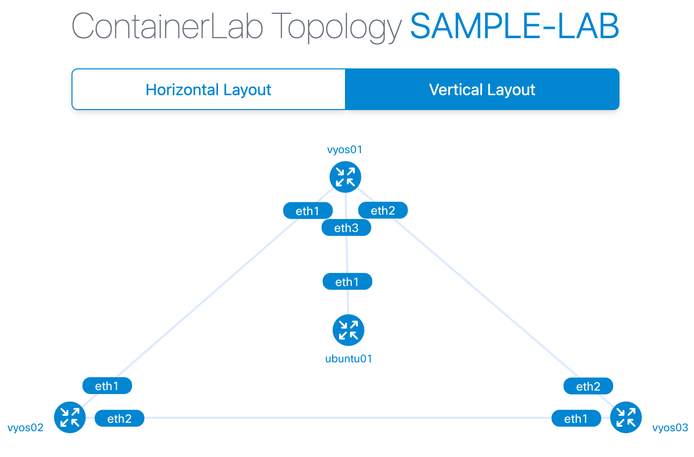

# vyos-build-container-image


[](https://hub.docker.com/r/muruu1/vyos)

## Quick reference

- [Containerlab](https://containerlab.dev/)
- [How to deploy VyOS in Containerlab](https://docs.google.com/document/d/1TUUVGLzetAX7_BIO6qtKDCC89j40eHa7bZrGiM5a3j8/edit?usp=sharing)

## How to use this image

- Install Docker and Containerlab
  - [Install Docker Engine](https://docs.docker.com/engine/install/)
  - [Install Containerlab](https://containerlab.dev/install/)
- make topology file
- deploy a lab

## Sample Lab



### Make topology file

sample-topology.yaml

```yaml=sample-topology.yaml
name: sample-lab

topology:
  nodes:
    vyos01:
      kind: linux
      image: muruu1/vyos:latest
      cmd: /sbin/init
      binds:
        - /lib/modules:/lib/modules
    vyos02:
      kind: linux
      image: muruu1/vyos:latest
      cmd: /sbin/init
      binds:
        - /lib/modules:/lib/modules
    vyos03:
      kind: linux
      image: muruu1/vyos:latest
      cmd: /sbin/init
      binds:
        - /lib/modules:/lib/modules
    ubuntu01:
      kind: linux
      image: ubuntu:latest
  links:
    - endpoints: ["vyos01:eth1", "vyos02:eth1"]
    - endpoints: ["vyos02:eth2", "vyos03:eth1"]
    - endpoints: ["vyos03:eth2", "vyos01:eth2"]
    - endpoints: ["vyos01:eth3", "ubuntu01:eth1"]
```

### Deploy a lab

```
sudo clab deploy -t sample-topology.yaml
```

### Connecting to the nodes

```bash
docker exec -it clab-sample-lab-vyos01 su vyos
```

### Destroy the lab

```
sudo clab destroy -t sample-topology.yaml
```
